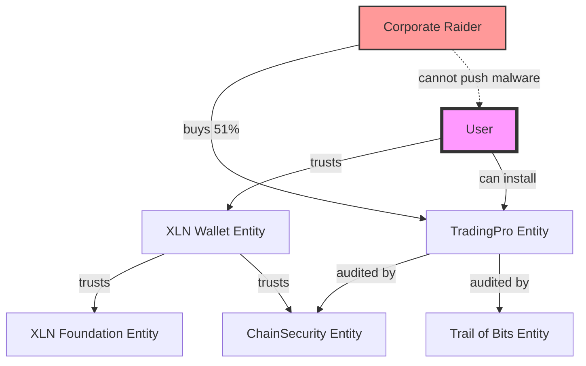

# Everything is an Entity: The Ultimate Composability

## Core Insight

**EVERYTHING** that changes or has governance becomes a tradeable entity with shares.

## No Special Cases

```typescript
// ❌ OLD WAY: Hardcoded special entities
const XLN_FOUNDATION = "0x123...";  // Fixed, special

// ✅ NEW WAY: Everything is just an entity
const xlnFoundation = createEntity({
  name: "XLN Foundation",
  shares: 1_000_000
});

const xlnFoundationClassic = createEntity({
  name: "XLN Foundation Classic",  // Fork it!
  shares: 1_000_000
});
```

## Examples of Entities

### 1. Protocol Governance
```typescript
// The foundation itself
const xlnFoundation = {
  name: "XLN Foundation",
  controls: ["wallet updates", "core protocol"],
  shares: tradeable
};

// Anyone can fork
const xlnClassic = forkEntity(xlnFoundation);
```

### 2. Infrastructure Components
```typescript
// Every contract is an entity
const entityProvider = {
  name: "EntityProvider.sol",
  shares: 1_000_000,  // Buy shares → control upgrades
  deploys: "0xContract..."
};

const depositary = {
  name: "Depositary.sol",  
  shares: 1_000_000
};
```

### 3. Wallet/Client Software
```typescript
// Wallet daemon updates signed by entity
const xlnWallet = {
  name: "XLN Wallet",
  quorum: walletDevTeam,
  signs: "software updates"
};

// Users choose which wallet entity to trust
user.trustedWallets = [xlnWallet, communityWallet];
```

### 4. Extensions/Plugins
```typescript
// Derivatives trading extension
const derivativesExt = {
  name: "Derivatives Pro",
  shares: 1_000_000,
  quorum: originalDevs
};

// Someone buys 51% shares
raider.buy(derivativesExt.shares, 510_000);
// Now controls the extension!
```

## The Ticker Revolution

### Old Way: Artificial Tickers
```
AAPL = Apple Inc.
GOOGL = Alphabet Inc.  
XLN = XLN Token
```

### New Way: Entity Names ARE Tickers
```typescript
// No separate ticker needed!
"Apple Inc" → auto-generates "Apple Inc" shares
"Google" → auto-generates "Google" shares
"Derivatives Pro" → auto-generates "Derivatives Pro" shares

// In a world of billions of entities, why invent tickers?
entity.name === entity.shares.name  // Always!
```

## Multi-Signature Security for Extensions

```typescript
// Extension installation requires multiple signatures
type ExtensionInstall = {
  extension: Entity,
  signatures: [
    extensionDev.signature,     // Creator signature
    auditFirm1.signature,       // External auditor 1
    auditFirm2.signature,       // External auditor 2
    xlnFoundation.signature?    // Optional blessing
  ]
};

// Auditors are also entities!
const chainSecurity = createEntity({
  name: "ChainSecurity Audits",
  shares: 1_000_000  // Buy their shares if you trust them
});
```

## Preventing the "Chrome Extension" Attack

**Problem**: Chinese buyers acquire extension → push malware

**Solution**: Multi-entity approval required
```typescript
function installExtension(ext: Extension) {
  // Need signatures from:
  require(ext.entity.sign());           // Extension owner
  require(trustedAuditor1.sign());      // Auditor 1 
  require(trustedAuditor2.sign());      // Auditor 2
  
  // Even if ownership changes, still need auditors
  // Auditors stake their reputation (share value)
}
```

## The Composability Explosion

### Everything Can Be:
1. **Created** as an entity
2. **Traded** via shares
3. **Governed** by shareholders/quorum
4. **Forked** by anyone
5. **Audited** by other entities
6. **Trusted** based on ownership

### Examples:
```typescript
// Price oracle entity
const chainlinkOracle = createEntity({ name: "Chainlink" });

// Insurance protocol entity  
const nexusMutual = createEntity({ name: "Nexus Mutual" });

// Even individual smart contracts
const uniswapV3Router = createEntity({ name: "Uniswap V3 Router" });

// Hostile takeover of infrastructure!
raider.buy("Uniswap V3 Router", 51%);
// Now controls router upgrades!
```

## Implementation Requirements

```typescript
interface UniversalEntity {
  // Identity
  name: string;  // Unique name = ticker
  shares: ShareInfo;  // Auto-created
  
  // Governance
  quorum: QuorumConfig;
  governanceMode: 'ShareholderPriority' | 'QuorumPriority';
  
  // What it controls (optional)
  controls?: {
    contracts?: Address[];
    software?: SoftwareHash[];
    oracles?: OracleID[];
    extensions?: ExtensionID[];
  };
  
  // Trust relationships
  trustedBy: EntityID[];
  trusts: EntityID[];
}
```

## The Network Effect



## Revolutionary Implications

1. **No hardcoded authorities** - Even foundation can be forked
2. **Market-based trust** - Share price reflects trustworthiness
3. **Hostile takeover protection** - Multi-entity approval required
4. **Infinite composability** - Entities trusting entities trusting entities
5. **True decentralization** - No special "admin" entities

This design creates a **living ecosystem** where every component can evolve, be traded, be forked, and be trusted based on market dynamics rather than hardcoded rules!