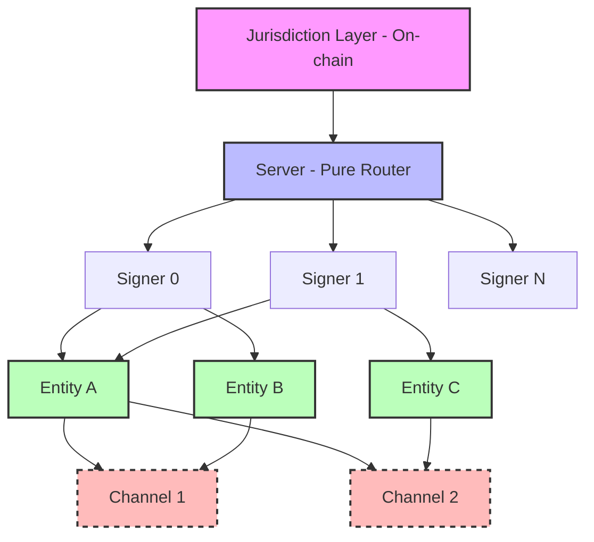

# XLN Architecture

## Layered System Design

XLN implements a hierarchical architecture where each layer follows the same pure functional pattern:

```
(prevState, inputBatch) → { nextState, outbox }
```

## System Layers



### Layer Responsibilities

| Layer                 | Pure? | Responsibility                                | Key Implementation                              |
| --------------------- | ----- | --------------------------------------------- | ----------------------------------------------- |
| **Jurisdiction (JL)** | ✗     | On-chain root of trust, collateral & disputes | `Depositary.sol`                                |
| **Server**            | ✓     | Routes messages, maintains global state       | [`applyServerBlock`](../src/core/server.ts#L42) |
| **Signer**            | ✓     | Holds entity replicas                         | `Replica = Map<entityId, EntityState>`          |
| **Entity**            | ✓     | BFT state machine, consensus                  | [`applyCommand`](../src/core/entity.ts#L125)    |
| **Channel**           | ✓     | Two-party state channels (future)             | `AccountProof`                                  |

## Core Processing Loop

The server processes inputs every 100ms in a deterministic cycle:

1. **Collect Inputs**: Gather all pending `Input` tuples from the mempool
2. **Apply Commands**: Route each input to the appropriate entity replica
3. **Process Outbox**: Collect inter-entity messages for next tick
4. **Compute Root**: Calculate global Merkle root of all entity states
5. **Persist**: Write ServerFrame to storage

### Code Example: Server Reducer

_Note: This is a simplified representation. The canonical data model for server inputs is defined in the [technical specification](./spec.md#4-canonical-data-model-typescript-style)._

```typescript
// From src/core/server.ts
export function applyServerBlock(
  state: ServerState,
  inputs: Input[],
): { state: ServerState; outbox: Input[] } {
  const outbox: Input[] = []

  for (const input of inputs) {
    const [signerIdx, entityId, cmd] = input
    const replica = state.replicas.get(addressFromIndex(signerIdx, entityId))

    if (replica) {
      const result = applyCommand(replica, cmd, outbox)
      state.replicas.set(addressFromIndex(signerIdx, entityId), result.state)
    }
  }

  return {
    state: { ...state, height: state.height + 1n },
    outbox,
  }
}
```

## Fractal Design Pattern

Every layer exposes the same reducer interface, enabling:

- **Composability**: Layers can be tested in isolation
- **Determinism**: Same inputs always produce same outputs
- **Auditability**: Full replay from any checkpoint

### Entity Reducer Example

```typescript
// From src/core/entity.ts
export function applyCommand(
  entity: EntityState,
  cmd: Command,
  outbox: Input[],
): { state: EntityState; outbox: Input[] } {
  switch (cmd.type) {
    case 'addTx':
      return addTransaction(entity, cmd.tx)
    case 'proposeFrame':
      return proposeFrame(entity, outbox)
    case 'commitFrame':
      return commitFrame(entity, cmd.frame, cmd.hanko)
    // ... other commands
  }
}
```

## State Management

Each entity maintains:

- **Consensus State**: Height, quorum, proposal status
- **Domain State**: Application-specific data (chat logs, balances)
- **Mempool**: Pending transactions
- **Signer Records**: Nonces for replay protection

## Message Flow

1. External clients submit transactions via RPC
2. Server validates and adds to mempool
3. Entity proposers create frames from mempool
4. Validators sign frame proposals
5. Aggregated signatures (Hanko) finalize frames
6. State changes propagate to all replicas

## Scalability

The architecture scales linearly because:

- Each entity processes independently
- No global consensus bottleneck
- Channels (future) enable bilateral scaling
- Only dispute resolution touches on-chain layer

See [Performance](./performance.md) for detailed benchmarks and targets.
