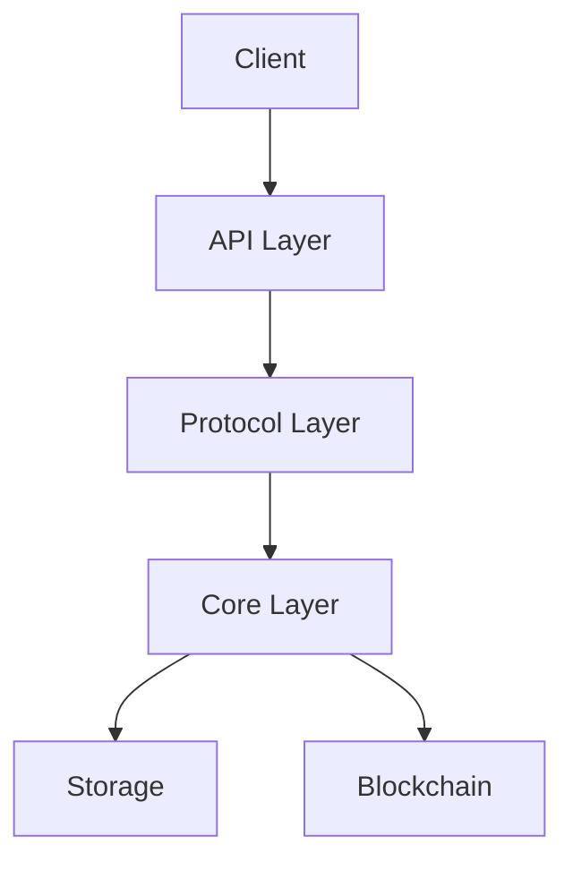
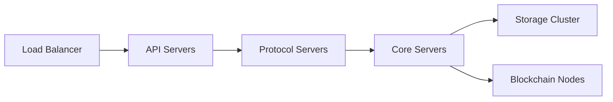

# System Architecture

## Overview

The system implements a state channel network with support for multi-token transfers, atomic swaps, and conditional payments. It follows a modular architecture with clear separation of concerns and well-defined interfaces between components.

## Architecture Layers

### 1. Core Layer

The foundation of the system, implementing core payment channel functionality:

- Channel state management
- State transitions
- Merkle tree verification
- Persistent storage

Key Components:
- `Channel`: Main channel management
- `HSTM`: State machine implementation
- `MerkleTree`: State verification
- `LevelStorageService`: Persistent storage

### 2. Protocol Layer

Implements the communication protocol between channel participants:

- Message serialization/deserialization
- State synchronization
- Block processing
- Signature verification

Components:
- `Transport`: Network communication
- `MessageProcessor`: Protocol message handling
- `StateSync`: State synchronization
- `SignatureVerifier`: Cryptographic verification

### 3. API Layer

Provides external interfaces for interacting with the system:

- REST API for channel management
- WebSocket API for real-time updates
- JSON-RPC API for blockchain interaction

Components:
- `APIServer`: HTTP/WebSocket server
- `RouteHandler`: API endpoint handling
- `WebSocketManager`: Real-time communication
- `BlockchainClient`: Chain interaction

## Component Interactions



### Data Flow

1. Client initiates action via API
2. API layer validates request
3. Protocol layer processes message
4. Core layer executes state transition
5. State changes are persisted
6. Response flows back to client

## State Management

### Channel State

- Hierarchical state structure
- Merkle-based verification
- Temporal state tracking
- Atomic state transitions

### State Synchronization

1. Block Creation
   - Group transitions
   - Verify validity
   - Create Merkle proof

2. Block Processing
   - Verify signatures
   - Apply transitions
   - Update state
   - Generate proofs

3. State Verification
   - Merkle proof verification
   - Signature validation
   - State consistency checks

## Security Architecture

### Cryptographic Security

- Elliptic curve signatures
- Hash-based commitments
- Merkle tree verification
- Secure key storage

### Network Security

- TLS encryption
- Message authentication
- Rate limiting
- DDoS protection

### State Security

- Atomic state updates
- Double-spend prevention
- Timeout handling
- Dispute resolution

## Scalability Design

### Horizontal Scaling

- Stateless API servers
- Distributed state storage
- Load balancing
- Connection pooling

### Performance Optimization

- State caching
- Batch processing
- Efficient proofs
- Optimized storage

## Deployment Architecture

### Components



### Infrastructure Requirements

1. **Compute Resources**
   - API servers: 2+ cores, 4GB+ RAM
   - Core servers: 4+ cores, 8GB+ RAM
   - Protocol servers: 2+ cores, 4GB+ RAM

2. **Storage Requirements**
   - Channel state: SSD storage
   - Transaction history: Scalable storage
   - Merkle trees: In-memory/SSD

3. **Network Requirements**
   - Low latency connections
   - High bandwidth capacity
   - Redundant networking

## Error Handling Architecture

### Error Types

1. **Application Errors**
   - Channel errors
   - State errors
   - Protocol errors

2. **System Errors**
   - Network errors
   - Storage errors
   - Resource errors

3. **Security Errors**
   - Authentication errors
   - Authorization errors
   - Cryptographic errors

### Error Recovery

1. **State Recovery**
   - State rollback
   - State reconciliation
   - Automatic retry

2. **Connection Recovery**
   - Automatic reconnection
   - Session recovery
   - State resynchronization

## Monitoring Architecture

### Metrics Collection

- Performance metrics
- State metrics
- Error metrics
- Network metrics

### Alerting

- Error rate alerts
- Performance alerts
- Security alerts
- Resource alerts

### Logging

- Application logs
- Error logs
- Security logs
- Audit logs

## Development Architecture

### Code Organization

```
src/
├── core/         # Core components
├── protocol/     # Protocol implementation
├── api/          # API endpoints
├── utils/        # Utilities
├── types/        # Type definitions
└── test/         # Test suites
```

### Development Workflow

1. **Code Changes**
   - Feature branches
   - Code review
   - Automated testing
   - CI/CD pipeline

2. **Testing Strategy**
   - Unit tests
   - Integration tests
   - Performance tests
   - Security tests

3. **Deployment Process**
   - Automated builds
   - Staging deployment
   - Production deployment
   - Monitoring 