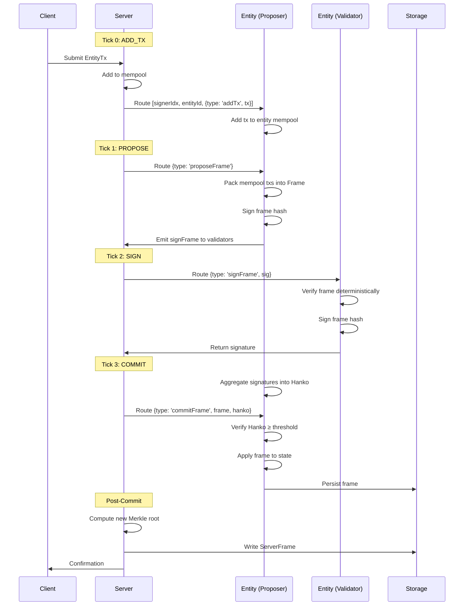

# Data Flow

## Transaction Lifecycle

XLN processes transactions through a deterministic clock-tick mechanism with the following stages:

## Clock-Tick Sequence Diagram



## Detailed Flow with Real Hashes

Based on actual test vectors from the "hello chat" example:

### 1. Transaction Submission (Tick N)
```typescript
// Client submits transaction
const tx: EntityTx = {
  kind: 'chat',
  data: { message: 'hello' },
  nonce: 1n,
  sig: '0xmocked'
};

// Creates Input tuple
const input: Input = [
  0,                    // signerIdx
  'testEntity',         // entityId
  { type: 'addTx', tx } // command
];
```

### 2. Frame Proposal (Tick N+1)
```typescript
// Proposer creates frame
const frame: Frame = {
  height: 1n,
  timestamp: 1625000000000n,
  txs: [tx],
  postState: { /* updated entity state */ }
};

// Frame hash: 0x3f2a8b9c4d5e6f7a8b9c0d1e2f3a4b5c
```

### 3. Signature Collection (Tick N+2)
```typescript
// Validators sign frame hash
signatures = {
  '0xaddr1': '0xsig1...',
  '0xaddr2': '0xsig2...'
};

// Collected weight: 67/100 (threshold met)
```

### 4. Frame Commitment (Tick N+3)
```typescript
// Aggregate into Hanko (BLS aggregate signature)
const hanko = '0x48bytes...';

// Commit command
const commit: Command = {
  type: 'commitFrame',
  frame,
  hanko
};

// New Merkle root: 0xf1e2d3c4b5a6978685746352413f2e1d
```

## State Transitions

Each command causes specific state mutations:

| Command | Entity State Change | Server State Change |
|---------|-------------------|-------------------|
| `addTx` | Append to mempool | None |
| `proposeFrame` | Set proposal, status='proposed' | None |
| `signFrame` | Add signature to proposal | None |
| `commitFrame` | Clear mempool, update height, apply txs | Update Merkle root |

## Determinism Guarantees

The flow ensures deterministic execution through:

1. **Fixed Ordering**: Inputs processed in submission order
2. **No Timestamps**: Frame timestamps set by proposer, not wall clock
3. **Pure Functions**: No side effects in state transitions
4. **Replay Protection**: Nonces prevent duplicate transactions

## Outbox Pattern

Inter-entity communication uses an outbox pattern:

```typescript
// Entity A sends message to Entity B
outbox.push([
  1,              // target signerIdx
  'entityB',      // target entityId
  { type: 'addTx', tx: crossEntityTx }
]);
```

Messages in the outbox become inputs in the next server tick, enabling asynchronous entity communication without breaking determinism.

## Performance Characteristics

- **Latency**: 4 ticks (400ms) from submission to finality
- **Throughput**: Limited by entity processing, not global consensus
- **Parallelism**: Different entities process independently

See [Consensus](./consensus.md) for detailed consensus mechanics and [Performance](./performance.md) for benchmarks.