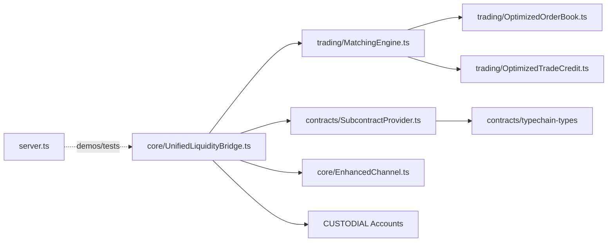

# Architecture Diagrams

Below are high-level Mermaid diagrams for quick orientation. View directly on GitHub (Mermaid supported) or paste into your preferred Mermaid viewer.

## Module Map
```mermaid
graph LR
  %% Core
  subgraph Consensus Core
    types[types.ts]
    utils[utils.ts]
    server[server.ts]
    entityFactory[entity-factory.ts]
    entityConsensus[entity-consensus.ts]
    entityTxApply[entity-tx/apply.ts]
    entityTxProposals[entity-tx/proposals.ts]
    entityTxFinancial[entity-tx/financial.ts]
    entityTxJ[entity-tx/j-events.ts]
    nameRes[name-resolution.ts]
    snap[snapshot-coder.ts]
  end

  server --> utils
  server --> types
  server --> entityFactory
  server --> entityConsensus
  server --> nameRes
  server --> snap
  entityConsensus --> entityTxApply
  entityTxApply --> entityTxProposals
  entityTxApply --> entityTxFinancial
  entityTxApply --> entityTxJ
  entityTxApply <-->|cycle: quorum power| entityConsensus
  nameRes --> utils

  %% EVM
  subgraph EVM Integration
    evm[evm.ts]
    contractsDir[contracts/* (Hardhat)]
    jurisdictions[jurisdictions.json]
  end

  server --> evm
  evm --> entityFactory
  evm --> utils
  evm --> jurisdictions
  evm --> contractsDir

  %% Trading & Channels
  subgraph Trading & Channels
    enhChan[core/EnhancedChannel.ts]
    subprov[contracts/SubcontractProvider.ts]
    match[trading/MatchingEngine.ts]
    tradeCredit[trading/OptimizedTradeCredit.ts]
    uniBridge[core/UnifiedLiquidityBridge.ts]
  end

  uniBridge --> match
  uniBridge --> subprov
  enhChan --> subprov
  match --> tradeCredit
  server -. demos/tests .-> uniBridge

  %% P2P & Monitoring
  subgraph P2P & Monitoring
    p2p[network/P2PNetwork.ts]
    mon[monitoring/*]
  end

  server --> mon
  p2p -. gossip .- uniBridge

  %% Frontend
  subgraph Frontend
    fe[frontend/ (SvelteKit)]
  end

  fe -. UI/API .- server
```

## Consensus Runtime Flow
```mermaid
flowchart TD
  A[Inputs: serverTxs + entityInputs] --> B[mergeEntityInputs]
  B --> C[applyServerInput]
  C --> D[Per-replica: applyEntityInput]
  D --> E[applyEntityTx: chat/propose/vote/profile/j_event]
  E --> F[State updates: frames, precommits, proposals]
  F --> G[env.height++ / timestamp++]
  G --> H[Capture snapshot → LevelDB]
  H --> I[Outbox: new EntityInputs]
  I -->|processUntilEmpty loop| C

  J[JEventWatcher (ethers RPC)] --> E
  K[Profiles/Name Index (Level)] --> E
  UI[Frontend] <---> server[server.ts]
```

## Trading Overview (Unified)


## Channels Overview
```mermaid
graph LR
  enhanced[core/EnhancedChannel.ts] --> state[ChannelState (deltas,tokens,nonce)]
  enhanced --> batch[propose/applyUpdate(batch)]
  enhanced --> events[EventEmitter (swap_created, update_applied,...)]
  enhanced --> sign[signUpdate()]

  enhanced --> subprov[contracts/SubcontractProvider.ts]
  subprov --> encode[encodeBatch()]
  subprov --> applyOff[applyBatch (off-chain)]
  subprov --> applyOn[applyBatchOnChain (dispute)]
  subprov --> ethers[ethers.js]

  disputes[forceClose()/dispute] --> onchain[(L1/L2 Contracts)]
  enhanced --> disputes
```
