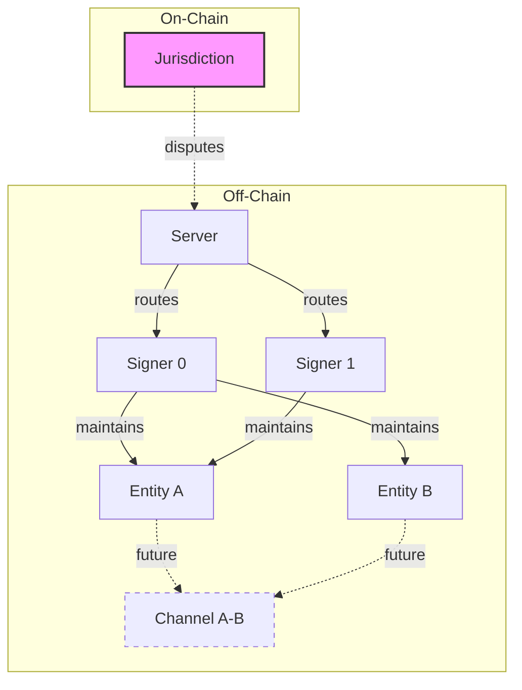

# Layered Architecture

XLN implements a hierarchical architecture where each layer has clearly defined responsibilities and interfaces.

## System Layers

| Layer                             | Pure? | Responsibility                                                                         | Key Objects                                 |
| --------------------------------- | ----- | -------------------------------------------------------------------------------------- | ------------------------------------------- |
| **Jurisdiction (JL)**             | ✗     | On-chain root of trust, collateral & dispute contracts                                 | `Depositary.sol`                            |
| **Server**                        | ✓     | Routes `Input` packets every 100 ms, seals `ServerFrame`, maintains global Merkle root | `ServerFrame`, `ServerTx`, mempool          |
| **Signer slot**                   | ✓     | Holds _replicas_ of each Entity for which its signer is in the quorum                  | `Replica = Map<entityId, EntityState>`      |
| **Entity**                        | ✓     | BFT-replicated state machine; builds & finalizes `Frame`s                              | `EntityInput`, `EntityTx`, `Frame`, `Hanko` |
| **Account / Channel** _(phase 2)_ | ✓     | Two-party mini-ledgers; HTLC / credit logic                                            | `AccountProof`, sub-contracts               |

_Fractal rule:_ every layer exposes the same pure reducer interface.

## Layer Details

### Jurisdiction Layer (External)

The only non-pure layer, residing on external blockchains:

- **Depositary Contract**: Manages collateral and reserves
- **Entity Registry**: Maps EntityID → Quorum commitment
- **Dispute Resolution**: Handles challenges with grace periods
- **Asset Bridge**: Locks/unlocks tokens for XLN use

> **Design Note**: Keeping the on-chain layer minimal reduces gas costs and attack surface. Most logic lives off-chain in the pure layers. This insight emerged from discussions about avoiding the complexity of rollup architectures.

### Server Layer

The root coordinator that:

- Maintains a 100ms heartbeat
- Routes inputs to appropriate entities
- Collects outputs from entity processing
- Computes global Merkle root
- Persists ServerFrames

```typescript
// Server state is just a collection of replicas
type ServerState = {
  height: bigint
  replicas: Map<Address, Replica>
  mempool: Input[]
}
```

### Signer Layer

A logical grouping rather than active component:

- Each signer (0, 1, 2...) has private keys
- Maintains replicas of entities where they're members
- Signs proposals and validates frames
- No direct signer-to-signer communication in MVP

### Entity Layer

The core business logic container:

- **Single-signer**: Personal wallets, instant finality
- **Multi-signer**: Organizations, BFT consensus
- **Quorum-defined**: Flexible voting thresholds
- **Domain-agnostic**: Chat, payments, governance, etc.

```typescript
type EntityState = {
  height: bigint
  quorum: Quorum
  signerRecords: Record<string, { nonce: bigint }>
  domainState: any // Application-specific
  mempool: EntityTx[]
  proposal?: { frame: Frame; sigs: Record<string, string> }
}
```

### Channel Layer (Future)

Bilateral state channels between entities:

- Two-party consensus only
- Sub-millisecond updates
- HTLC for atomic swaps
- Credit lines instead of locked collateral

## Inter-Layer Communication



## Design Rationale

### Why Hierarchical?

Traditional blockchains force all transactions through global consensus. XLN recognizes that:

1. Most transactions only need local agreement
2. Organizations naturally form hierarchies
3. Disputes are rare and can be escalated
4. Linear scaling requires independence

### Why Pure Functions?

Each layer processes inputs deterministically:

```typescript
// Every layer follows this pattern
function processLayer<S, I>(state: S, inputs: I[]): { state: S; outputs: any[] } {
  // Pure transformation
  return { state: newState, outputs }
}
```

Benefits:

- Easy testing
- Deterministic replay
- No race conditions
- Clear audit trail

### Why Separate Signers?

Signers are identity/key management:

- Can participate in multiple entities
- Can be individuals or institutions
- Can rotate keys without disrupting entities
- Can maintain selective replicas

## Comparison with Other Architectures

| Feature           | XLN            | Rollups      | Cosmos     | Lightning        |
| ----------------- | -------------- | ------------ | ---------- | ---------------- |
| Consensus         | Per-entity     | Global L2    | Per-zone   | Bilateral        |
| Data Availability | Local replicas | DA layer     | Validators | Channel partners |
| Finality          | 100ms          | L1 dependent | 6s         | Instant          |
| Sovereignty       | Full           | Limited      | Full       | Limited          |
| Complexity        | Low            | High         | Medium     | Medium           |

## Implementation Notes

The layered architecture enables:

1. **Modular Development**: Each layer can be built/tested independently
2. **Flexible Deployment**: Run subset of layers for specific use cases
3. **Progressive Decentralization**: Start with single server, add redundancy
4. **Clear Upgrade Path**: Layers can evolve independently

For the data structures used between layers, see [Data Model](./data-model.md).
