# Performance

XLN is designed for high-throughput, low-latency transaction processing with linear scalability.

## Performance Targets

| Metric | Target | Note |
|--------|--------|------|
| **Server tick** | 100 ms (configurable) | Fixed heartbeat |
| **Off-chain TPS** | Unbounded | Each Entity & Channel independent |
| **Jurisdiction TPS** | ≈ 10 | Only deposits/disputes touch chain |
| **Roadmap capacity** | > 10⁹ TPS | Linear with hubs & channels |

## Current Benchmarks

### Single Entity Performance

```typescript
// Benchmark: Single-signer entity
const results = {
  throughput: '12,000 TPS',
  latency: '100ms (1 tick)',
  cpuUsage: '15%',
  memoryUsage: '250 MB',
  stateSize: '10 MB'
};
```

### Multi-Entity Scaling

```typescript
// Benchmark: 100 entities, mixed workload
const scaling = {
  entities: 100,
  totalTPS: 450_000,
  avgLatency: '400ms',
  p99Latency: '600ms',
  cpuCores: 8,
  memory: '8 GB'
};
```

## Scalability Model

### Horizontal Scaling

XLN scales linearly because:

1. **Independent Entities**: No coordination overhead
2. **Sharded State**: Each entity owns its data
3. **Local Consensus**: No global agreement needed
4. **Parallel Execution**: Multi-core friendly

```
Total TPS = Σ(Entity_i TPS) + Σ(Channel_j TPS)
```

### Vertical Scaling

Single entity limits:

| Resource | Bottleneck | Mitigation |
|----------|------------|------------|
| CPU | Transaction verification | Batch verification |
| Memory | State size | State pruning |
| Disk I/O | WAL writes | SSD, write batching |
| Network | Signature collection | Signature aggregation |

## Performance Characteristics

### Latency Breakdown

For multi-signer entities (4 ticks = 400ms):

```mermaid
gantt
    title Transaction Latency Breakdown
    dateFormat X
    axisFormat %L
    
    section Client
    Submit TX :done, submit, 0, 10
    
    section Server
    Route to Entity :active, route, 10, 20
    
    section Entity
    Add to Mempool :done, mempool, 20, 100
    Propose Frame :done, propose, 100, 200
    Collect Signatures :done, sign, 200, 300
    Commit Frame :done, commit, 300, 400
    
    section Client
    Receive Confirmation :milestone, 400, 0
```



### Throughput Analysis

```typescript
// Theoretical maximum TPS per entity
const maxTPS = {
  singleSigner: {
    txSize: 200,          // bytes
    frameSize: 1_000_000, // 1 MB
    txPerFrame: 5_000,
    framesPerSec: 10,     // 100ms ticks
    tps: 50_000
  },
  multiSigner: {
    txSize: 200,
    frameSize: 1_000_000,
    txPerFrame: 5_000,
    framesPerSec: 2.5,    // 400ms consensus
    tps: 12_500
  }
};
```

## Optimization Strategies

### 1. Transaction Batching

```typescript
// Batch multiple operations
const batchTx: EntityTx = {
  kind: 'batch',
  data: {
    ops: [
      { type: 'transfer', to: 'Alice', amount: 100 },
      { type: 'transfer', to: 'Bob', amount: 200 },
      { type: 'transfer', to: 'Carol', amount: 300 }
    ]
  }
};
// 3 transfers, 1 signature verification
```

### 2. State Caching

```typescript
class CachedEntity {
  private stateCache = new LRU(1000);
  private computeCache = new Map();
  
  getBalance(account: string): bigint {
    if (this.stateCache.has(account)) {
      return this.stateCache.get(account);
    }
    // Compute and cache
  }
}
```

### 3. Parallel Verification

```typescript
async function verifyFrameParallel(frame: Frame) {
  const results = await Promise.all(
    frame.txs.map(tx => verifyTx(tx))
  );
  return results.every(r => r === true);
}
```

### 4. Write Batching

```typescript
class BatchedWAL {
  private buffer: Input[] = [];
  
  async add(input: Input) {
    this.buffer.push(input);
    
    if (this.buffer.length >= 100) {
      await this.flush();
    }
  }
  
  async flush() {
    const batch = db.batch();
    for (const input of this.buffer) {
      batch.put(walKey(input), encode(input));
    }
    await batch.write();
    this.buffer = [];
  }
}
```

## Comparison with Other Systems

| System | TPS | Latency | Finality | Decentralization |
|--------|-----|---------|----------|------------------|
| **XLN (1 entity)** | 12,000 | 100-400ms | Instant | High |
| **XLN (1000 entities)** | 12M | 100-400ms | Instant | High |
| Bitcoin | 7 | 10 min | 60 min | Very High |
| Ethereum | 15 | 12 sec | 15 min | Very High |
| Solana | 50,000 | 400ms | 15 sec | Medium |
| Lightning | 1M+ | <1 sec | Instant* | Medium |
| Visa | 65,000 | 1-2 sec | Days | Low |

*Lightning finality depends on on-chain settlement

## Resource Requirements

### Minimum Specifications

```yaml
# Single entity
cpu: 2 cores
memory: 4 GB
disk: 100 GB SSD
network: 100 Mbps

# 100 entities
cpu: 8 cores
memory: 16 GB
disk: 1 TB NVMe
network: 1 Gbps
```

### Recommended Production

```yaml
# High-performance setup
cpu: 32 cores (AMD EPYC or Intel Xeon)
memory: 128 GB ECC
disk: 4 TB NVMe RAID 10
network: 10 Gbps
backup: Hourly snapshots to S3
```

## Performance Monitoring

Key metrics to track:

```typescript
interface PerformanceMetrics {
  // Throughput
  tps: number;
  frameRate: number;
  
  // Latency
  p50Latency: number;
  p99Latency: number;
  maxLatency: number;
  
  // Resources
  cpuUsage: number;
  memoryUsage: number;
  diskIOPS: number;
  networkBandwidth: number;
  
  // Application
  mempoolSize: number;
  stateSize: number;
  validatorCount: number;
}
```

## Future Optimizations

### Phase 1: Current
- Batch verification
- Memory pooling
- Basic caching

### Phase 2: Planned
- GPU acceleration for signatures
- Zero-copy networking
- Custom serialization
- SIMD operations

### Phase 3: Research
- State pruning
- Incremental merkle trees
- Parallel consensus
- Hardware acceleration

## Performance Testing

### Load Testing Script

```typescript
async function loadTest(entity: Entity, duration: number) {
  const start = Date.now();
  let txCount = 0;
  
  while (Date.now() - start < duration) {
    const batch = [];
    for (let i = 0; i < 1000; i++) {
      batch.push(generateTx());
    }
    
    await Promise.all(
      batch.map(tx => entity.submitTx(tx))
    );
    
    txCount += batch.length;
  }
  
  const tps = txCount / (duration / 1000);
  console.log(`Achieved ${tps} TPS`);
}
```

### Stress Boundaries

System behavior under stress:

| Load | Behavior |
|------|----------|
| < 80% | Linear performance |
| 80-95% | Increased latency |
| 95-99% | Mempool growth |
| > 99% | Transaction rejection |

The architecture ensures graceful degradation rather than catastrophic failure.

For configuration options affecting performance, see [Configuration](./configuration.md).