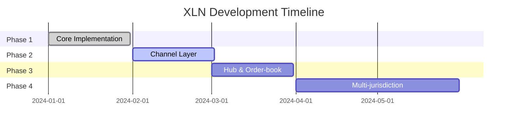

# Roadmap

XLN development follows a phased approach, building complexity incrementally while maintaining a working system at each stage.

## Overview



## Milestones

### M1 – "DAO-only" ✓ Current

*Entities with quorum governance, chat/wallet demo, no channels.*

**Completed**:
- ✅ Basic server loop with 100ms ticks
- ✅ Entity state management
- ✅ Frame-based consensus
- ✅ LevelDB persistence with WAL
- ✅ Single and multi-signer entities
- ✅ RLP encoding throughout
- ✅ Merkle root computation
- ✅ Chat and wallet demos

**Status**: MVP complete, ready for testing

### M2 – Channel Layer

*Bidirectional payment channels, collateral & credit logic.*

**Planned Features**:
- [ ] Channel state machine
- [ ] HTLC implementation
- [ ] Credit line management
- [ ] Atomic multi-hop routing
- [ ] Channel dispute resolution
- [ ] Collateral optimization
- [ ] Payment streaming
- [ ] Channel backup/restore

**Technical Changes**:
```typescript
// New types
type Channel = {
  parties: [Entity, Entity];
  balances: [bigint, bigint];
  nonce: bigint;
  htlcs: HTLC[];
};

type HTLC = {
  hash: string;
  amount: bigint;
  expiry: bigint;
};
```

**Target Metrics**:
- 1M+ TPS per channel
- Sub-millisecond updates
- Atomic cross-entity swaps

### M3 – Hub & Order-book Entities

*Liquidity routing, on-channel AMM snippets.*

**Planned Features**:
- [ ] Hub entity type
- [ ] Automated market making
- [ ] Order matching engine
- [ ] Liquidity aggregation
- [ ] Fee management
- [ ] Route discovery
- [ ] Rebalancing strategies
- [ ] Analytics dashboard

**Architecture**:
```typescript
// Hub entity
type HubState = {
  channels: Map<EntityId, Channel>;
  orderBook: OrderBook;
  liquidityPools: Map<TokenPair, Pool>;
  fees: FeeSchedule;
};
```

**Business Logic**:
- Cross-entity routing
- Dynamic fee adjustment
- Liquidity incentives
- MEV protection

### M4 – Multi-jurisdiction Deployment

*Jurisdiction adapters for several L1s, fiat on/off-ramp partnerships.*

**Planned Jurisdictions**:
- [ ] Ethereum mainnet
- [ ] Arbitrum One
- [ ] Polygon PoS
- [ ] Binance Smart Chain
- [ ] Avalanche C-Chain
- [ ] Starknet (researching)

**Integration Features**:
- [ ] Unified deposit contract
- [ ] Cross-chain messaging
- [ ] Asset bridge standardization
- [ ] Fiat gateway partnerships
- [ ] Compliance framework
- [ ] Multi-sig treasury
- [ ] Insurance fund
- [ ] Governance token

**Deployment Strategy**:
1. Testnet deployment on all chains
2. Limited mainnet with caps
3. Gradual limit increases
4. Full production launch

## Future Phases (2024+)

### Phase 5: Advanced Features

**Q3 2024**:
- Zero-knowledge proofs for privacy
- Threshold signatures
- State compression
- Mobile SDK

### Phase 6: Ecosystem

**Q4 2024**:
- Developer grants program
- Plugin architecture
- Marketplace for entities
- Integration partnerships

### Phase 7: Decentralization

**2025**:
- Multi-server consensus
- Decentralized governance
- Community validators
- Protocol ossification

## Development Priorities

### Immediate (Next Sprint)
1. Real signature implementation
2. Network authentication
3. Performance benchmarking
4. Security audit preparation

### Short Term (Next Month)
1. Channel proof of concept
2. Cross-entity messaging
3. State pruning
4. Monitoring dashboard

### Medium Term (Next Quarter)
1. Production deployment
2. External integrations
3. SDK development
4. Documentation expansion

## Success Metrics

Each milestone has specific success criteria:

| Milestone | Key Metric | Target |
|-----------|------------|--------|
| M1 | Entity consensus working | ✅ Done |
| M2 | Channel TPS | 1M+ |
| M3 | Routing efficiency | <3 hops average |
| M4 | Chain coverage | 5+ L1s |

## Risk Mitigation

### Technical Risks

| Risk | Mitigation |
|------|------------|
| Consensus bugs | Extensive testing, formal verification |
| Performance bottlenecks | Profiling, optimization sprints |
| Storage growth | State pruning, archival nodes |
| Network partitions | Timeout recovery, social consensus |

### Business Risks

| Risk | Mitigation |
|------|------------|
| Adoption | Developer incentives, partnerships |
| Regulation | Legal review, compliance framework |
| Competition | Fast execution, unique features |
| Funding | Diverse revenue streams |

## Contributing

Ways to contribute to roadmap goals:

1. **Code**: Pick up GitHub issues tagged with milestones
2. **Testing**: Run nodes, report bugs, stress test
3. **Documentation**: Improve guides, create tutorials
4. **Integration**: Build on XLN, create demos
5. **Research**: Propose improvements, analyze tradeoffs

## Tracking Progress

- **GitHub Project Board**: [Link to board]
- **Weekly Updates**: Published in Discord
- **Milestone Reviews**: Public calls monthly
- **Metrics Dashboard**: [Link to dashboard]

## Version History

| Version | Date | Changes |
|---------|------|---------|
| 0.1 | Jan 2024 | Initial roadmap |
| 0.2 | Feb 2024 | Added success metrics |
| 0.3 | Mar 2024 | Updated after M1 completion |

For current implementation status, see [Changelog](../CHANGELOG.md).