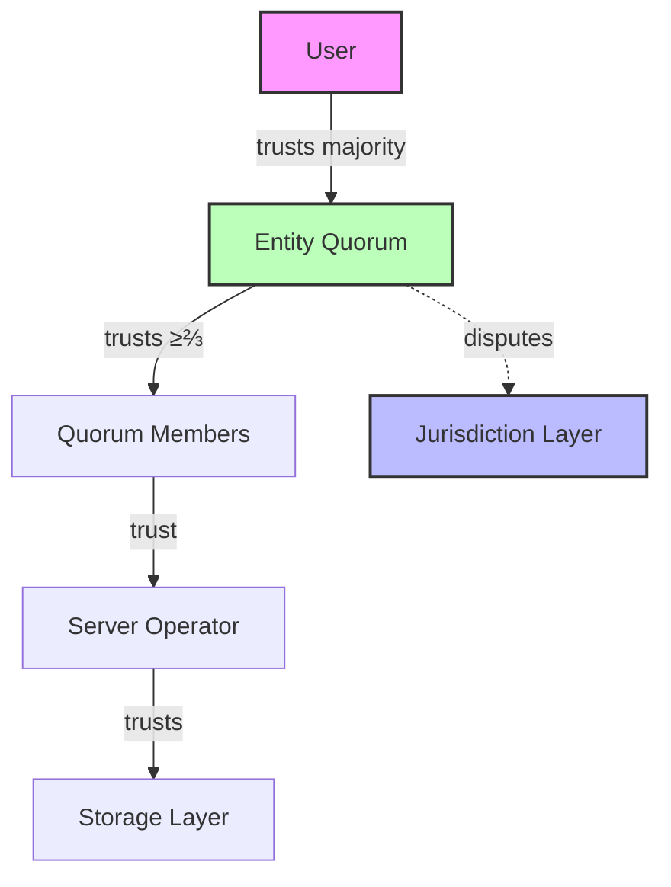

# Security Model

XLN's security architecture is built on layered defense with clear trust boundaries and explicit assumptions.

## Trust Model

### Hierarchical Trust



### Security Assumptions

| Component    | Assumption          | Failure Mode       | Impact            |
| ------------ | ------------------- | ------------------ | ----------------- |
| Entity       | ≥⅔ shares honest    | Byzantine takeover | Loss of funds     |
| Server       | Crash-only failures | Censorship         | Liveness loss     |
| Storage      | No tampering        | State corruption   | Requires recovery |
| Network      | Authenticated       | MITM attacks       | Message forgery   |
| Jurisdiction | Contract secure     | Smart contract bug | Systemic failure  |

## Byzantine Fault Tolerance

### Entity Level BFT

Entities tolerate up to ⅓ Byzantine weight:

```typescript
const byzantineThreshold = Math.floor(totalWeight / 3)
const honestWeight = totalWeight - byzantineThreshold
const requiredWeight = Math.ceil((totalWeight * 2) / 3)

assert(honestWeight >= requiredWeight) // Always true
```

**Properties**:

- **Safety**: No conflicting frames can be committed
- **Liveness**: Honest majority can always progress
- **Finality**: Committed frames are irreversible

### Attack Scenarios

#### 1. Forged Frame Attack

```typescript
// Attack: Malicious proposer creates invalid frame
frame = {
  height: 100n,
  txs: [stealFundsTx], // Malicious transaction
  postState: falseState, // Incorrect result
}

// Defense: Validators independently verify
for (const validator of validators) {
  const computed = applyTxs(currentState, frame.txs)
  if (!deepEqual(computed, frame.postState)) {
    // Reject and don't sign
    return { type: 'reject', reason: 'Invalid state transition' }
  }
}
```

#### 2. Double-Spend Attack

```typescript
// Attack: Same nonce used twice
tx1 = { nonce: 5n, op: 'transfer', to: 'Alice', amount: 100 }
tx2 = { nonce: 5n, op: 'transfer', to: 'Bob', amount: 100 }

// Defense: Nonce tracking
if (tx.nonce !== signerRecord.nonce + 1n) {
  throw new Error(`Invalid nonce: expected ${signerRecord.nonce + 1n}`)
}
signerRecord.nonce = tx.nonce
```

#### 3. Long-Range Attack

```typescript
// Attack: Fork from old state
const oldFrame = getFrameAt(height - 1000n)
const forkedChain = buildAlternativeHistory(oldFrame)

// Defense: Finality + social consensus
if (frame.height < finalizedHeight) {
  throw new Error('Cannot fork finalized history')
}
```

## Cryptographic Security

### Signature Schemes

Currently using placeholder signatures, production will use:

| Algorithm  | Use Case               | Security Level    |
| ---------- | ---------------------- | ----------------- |
| BLS12-381  | Aggregate signatures   | 128-bit           |
| Ed25519    | Transaction signatures | 128-bit           |
| Keccak-256 | Hashing                | 128-bit collision |

### Key Management

```typescript
// Planned implementation
interface KeyManager {
  // Derive keys from master seed
  deriveKey(path: string): PrivateKey

  // Sign with hardware security module
  signWithHSM(message: Uint8Array): Promise<Signature>

  // Threshold signing for critical operations
  thresholdSign(message: Uint8Array, threshold: number): Promise<ThresholdSignature>
}
```

## Access Control

### Entity Membership

Only quorum members can:

- Submit transactions
- Propose frames
- Sign proposals
- Access entity state

```typescript
function authorize(entity: EntityState, signerAddr: string, action: string): boolean {
  const member = entity.quorum.members.find((m) => m.address === signerAddr)

  if (!member) {
    throw new Error('Not a quorum member')
  }

  // Additional role-based checks
  switch (action) {
    case 'propose':
      return isCurrentProposer(entity, signerAddr)
    case 'sign':
      return member.shares > 0n
    default:
      return true
  }
}
```

### Server Access

MVP assumes trusted server, production will have:

1. **Mutual TLS**: Client certificates for signers
2. **API Keys**: Rate-limited access tokens
3. **IP Allowlists**: Geographic restrictions
4. **DDoS Protection**: CloudFlare or similar

## Operational Security

### Monitoring

Critical security events to monitor:

```typescript
enum SecurityEvent {
  INVALID_SIGNATURE = 'invalid_signature',
  NONCE_REPLAY = 'nonce_replay',
  BYZANTINE_BEHAVIOR = 'byzantine_behavior',
  STORAGE_CORRUPTION = 'storage_corruption',
  CONSENSUS_FAILURE = 'consensus_failure',
}

function logSecurityEvent(event: SecurityEvent, details: any) {
  console.error(`[SECURITY] ${event}`, {
    timestamp: new Date().toISOString(),
    ...details,
  })

  // Alert operators
  if (isCritical(event)) {
    sendAlert(event, details)
  }
}
```

### Incident Response

1. **Detection**: Automated monitoring alerts
2. **Containment**: Pause affected entities
3. **Investigation**: Analyze logs and state
4. **Recovery**: Restore from last good state
5. **Post-Mortem**: Document and prevent recurrence

## Smart Contract Security

### Jurisdiction Layer Risks

The on-chain component faces unique risks:

| Risk                | Mitigation                          |
| ------------------- | ----------------------------------- |
| Reentrancy          | Checks-effects-interactions pattern |
| Integer overflow    | SafeMath / Solidity 0.8+            |
| Access control      | OpenZeppelin libraries              |
| Upgradability       | Time-locked proxy patterns          |
| Oracle manipulation | Multiple price feeds                |

### Formal Verification

Critical invariants for formal proofs:

1. **Conservation**: Total balance in = total balance out
2. **Authorization**: Only owners can move funds
3. **Finality**: Committed frames cannot change
4. **Liveness**: Honest majority can progress

## Remaining Gaps (MVP)

Current implementation gaps and planned mitigations:

| Gap               | Current State       | Production Plan          |
| ----------------- | ------------------- | ------------------------ |
| Signatures        | String placeholders | BLS12-381 implementation |
| Network auth      | None                | mTLS + libp2p            |
| Rate limiting     | None                | Token bucket per signer  |
| Mempool bounds    | Unlimited           | 10K tx limit             |
| Server redundancy | Single point        | Multi-server consensus   |
| Key rotation      | Not supported       | Quorum update protocol   |

## Security Checklist

Before mainnet deployment:

- [ ] Real signature verification
- [ ] Mempool size limits
- [ ] Network authentication
- [ ] Rate limiting
- [ ] Audit logging
- [ ] Incident response plan
- [ ] Security audit by firm
- [ ] Formal verification of core
- [ ] Bug bounty program
- [ ] Insurance coverage

## Defense in Depth

Multiple layers of security:

1. **Cryptographic**: Signatures, hashes
2. **Consensus**: BFT quorum agreement
3. **Application**: Nonce tracking, validation
4. **Network**: TLS, authentication
5. **Operational**: Monitoring, response
6. **Economic**: Stake slashing (future)

Each layer assumes others may fail, providing comprehensive protection.

For specific attack scenarios, see [Threat Model](./threat-model.md).
