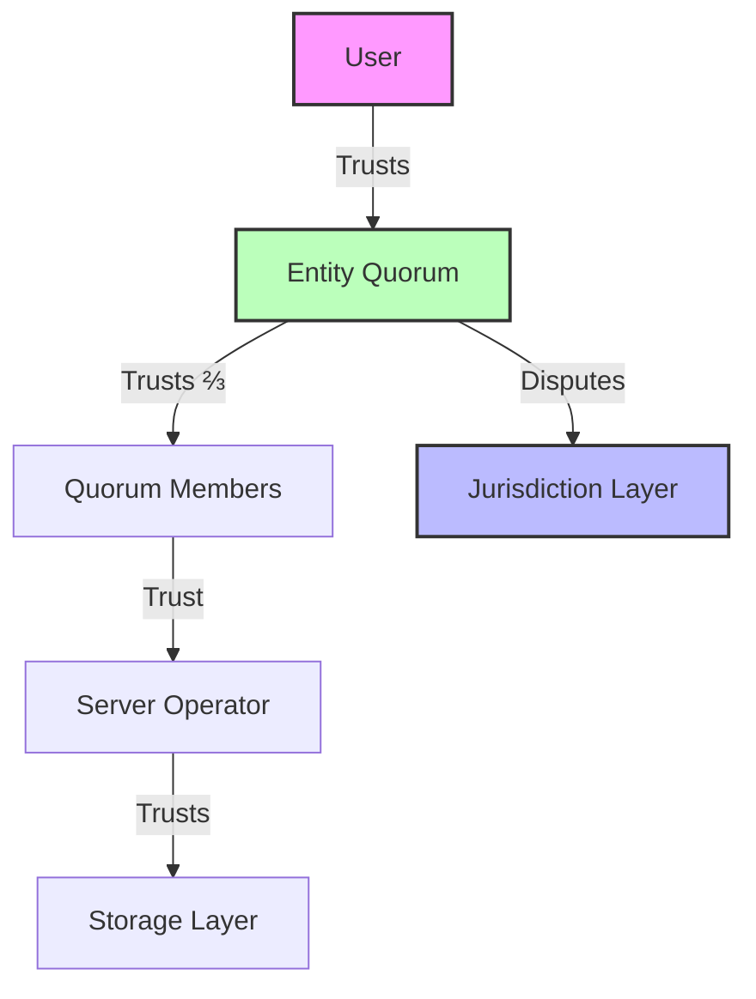

# Threat Model

## Security Assumptions and Threat Analysis

XLN's security model is based on layered trust assumptions and specific threat mitigations at each level.

## Threat Matrix

| Layer | Honest-Party Assumption | Main Threats | Mitigations | Status |
|-------|------------------------|--------------|-------------|---------|
| **Entity** | ≥ ⅔ weighted shares honest | Forged frames, vote replay | BLS aggregate signatures, per-signer nonces | ✓ Implemented |
| **Server** | Crash-only failures | WAL corruption, state divergence | Hash assertions on replay, deterministic execution | ✓ Implemented |
| **Jurisdiction** | Single systemic contract | Contract bugs, exploits | Formal verification, minimal surface area | ⚠️ Future |
| **Network** | Authenticated channels | Man-in-the-middle, DDoS | TLS, peer authentication | ⚠️ MVP Gap |

## Detailed Threat Analysis

### 1. Entity-Level Threats

#### Forged Frames
- **Attack**: Malicious proposer creates invalid frame
- **Mitigation**: All validators independently verify frame execution
- **Implementation**: [`verifyFrame()`](../src/core/entity.ts#L200)

#### Vote Replay
- **Attack**: Replay old signatures on new proposals
- **Mitigation**: Per-signer nonces, frame height in hash
- **Implementation**: `signerRecords[addr].nonce` tracking

#### Quorum Rotation Attack
- **Attack**: Ex-member rejoins and replays old votes
- **Mitigation**: Nonces retained for all historical members
- **Note**: Prevents "amnesia" attacks during quorum changes

### 2. Server-Level Threats

#### WAL Corruption
- **Attack**: Corrupted write-ahead log causes invalid replay
- **Mitigation**: Hash verification at each replay step
- **Recovery**: Fall back to last valid snapshot

#### Snapshot/WAL Mismatch
- **Attack**: Tampered snapshot doesn't match WAL sequence
- **Mitigation**: Merkle root verification after replay
- **Detection**: Halt on mismatch, require manual intervention

#### Byzantine Server
- **Current Gap**: Server assumed honest in MVP
- **Future**: Multi-server consensus for critical deployments

### 3. Storage Threats

#### Data Tampering
- **Attack**: Modify historical frames or snapshots
- **Mitigation**: Content-addressed storage (CAS)
- **Implementation**: Frame hash as storage key

#### Rollback Attack
- **Attack**: Restore old snapshot, replay partial WAL
- **Mitigation**: Monotonic height checks, external anchoring
- **Future**: Periodic Merkle root commits to Jurisdiction

### 4. Network Threats (Future)

#### Message Forgery
- **Attack**: Fake messages between entities
- **Mitigation**: Ed25519 signatures on all messages
- **Status**: Mocked in MVP, required for production

#### Routing Attacks
- **Attack**: Misdirect messages to wrong entities
- **Mitigation**: Authenticated entity registry
- **Implementation**: libp2p peer ID verification

#### Denial of Service
- **Attack**: Flood server with invalid transactions
- **Mitigation**: Rate limiting, stake-based priority
- **Status**: No protection in MVP

## Security Invariants

The system maintains these security properties:

1. **No Double Spending**: Deterministic nonce tracking
2. **No Forks**: Single proposer per height
3. **Byzantine Fault Tolerance**: Up to ⅓ malicious weight
4. **Audit Trail**: Complete replay from genesis

## Trust Model

## Remaining Security Gaps (MVP)

1. **Signature Verification**: Currently mocked with string placeholders
2. **Byzantine Server Detection**: No mechanism to detect malicious server
3. **Unbounded Mempool**: Vulnerable to memory exhaustion
4. **Network Authentication**: No peer verification
5. **Rate Limiting**: No transaction throttling

## Mitigation Roadmap

| Milestone | Security Additions |
|-----------|-------------------|
| M1 (Current) | Basic consensus, deterministic replay |
| M2 | Real signatures, authenticated storage |
| M3 | Network auth, rate limiting |
| M4 | Multi-jurisdiction, formal verification |

## Security Checklist for Deployment

- [ ] Enable real BLS signatures (replace mocks)
- [ ] Implement mempool size limits
- [ ] Add transaction signature verification
- [ ] Enable TLS for all network connections
- [ ] Implement rate limiting per signer
- [ ] Set up monitoring for consensus failures
- [ ] Regular security audits of critical paths
- [ ] Formal verification of consensus algorithm

For implementation details, see [Security](./security.md) and [Edge Cases](./edge-cases.md).